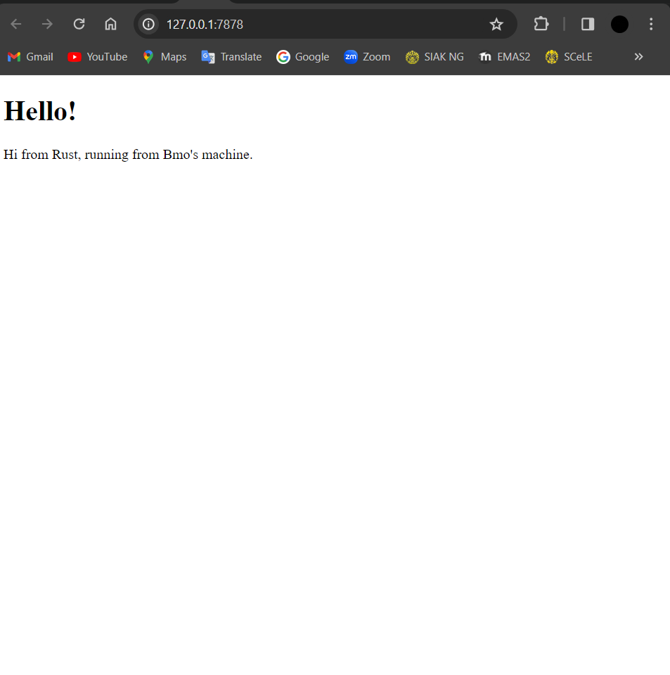
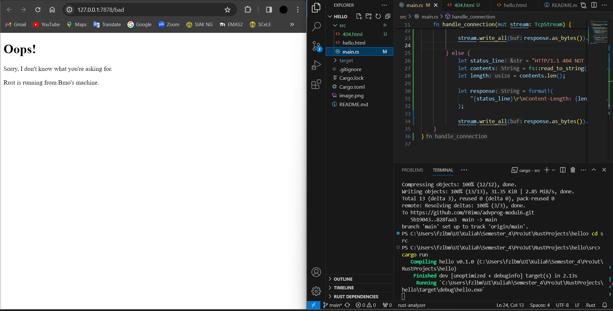

# Refleksi Tutorial Pemrograman Lanjut

<details>
<summary style="font-size:24px">Tutorial 6</summary>

## Commit 1 Reflection Notes
Berikut merupakan penjelasan mengenai fungsi `handle_connection`,

```
...
fn handle_connection(mut stream: TcpStream)
...
```
Baris kode di atas berfungsi untuk mengambil _ownership_ dari `TcpStream` yang akan merepresentasikan koneksi TCP.


```
...
let buf_reader = BufReader::new(&mut stream);
...
```
Baris kode di atas akan membuat _instance_ `BufReader` yang nantinya akan digunakan untuk membaca teks dari _stream_ secara efisien.

```
...
let http_request: Vec<_> = buf_reader 
    .lines() 
    .map(|result| result.unwrap())
    .take_while(|line| !line.is_empty()) 
    .collect();
...
```
- `buf_reader .lines()` berguna untuk membaca setiap baris dari _buffered reader_.
- `.map(|result| result.unwrap())` melakukan pemetaan setiap _result_ ke _unwrapped value_-nya.
- `.take_while(|line| !line.is_empty())` digunakan untuk mengambil setiap baris yang ada sampai bertemu dengan baris kosong yang menandakan berakhirnya _request headers_ HTTP.
- `Vec<_>` berfungsi untuk menyimpan setiap baris yang sudah diambil dengan tipe yang menyesuaikan. 

```
...
println!("Request: {:#?}", http_request);
...
```
Mencetak setiap baris yang sudah dikumpulkan yang berisi _request_ HTTP. Jadi secara singkat, fungsi ini akan membaca _request_ HTTP dari _stream_ TCP dan akan berhenti apabila bertemu dengan baris yang kosong. 

## Commit 2 Reflection Notes



Ada beberapa bagian kode yang ditambahkan untuk memunculkkan hasil yang diperoleh pada gambar di atas,
- mendefinisikan status `"HTTP/1.1 200 OK"`
- membaca konten dari `hello.html` dengan mengubahnya ke variabel _string_ `contents` menggunakan `fs::read_to_string("hello.html").unwrap()`
- melakukan kalkulasi panjang dari `contents` dengan `contents.len()`
- mengonstruksi _string_ respons HTTP termasuk di dalamnya ada status, panjang konten, dan konten dari `hello.html`
- kode perlu juga menuliskan respons HTTP kembali ke TCP _stream_ menggunakan `stream.write_all(response.as_bytes()).unwrap()`.

Berikut merupakan baris kode yang perlu ditambahkan di dalam fungsi `handle_connection`,

```
...
 let status_line = "HTTP/1.1 200 OK";
        let contents = fs::read_to_string("hello.html").unwrap();
        let length = contents.len();

        let response = format!("{status_line}\r\nContent-Length:
        {length}\r\n\r\n{contents}");
        stream.write_all(response.as_bytes()).unwrap();
...
```
## Commit 3 Reflection Notes



```
...
else {
            let status_line = "HTTP/1.1 404 NOT FOUND";
            let contents = fs::read_to_string("404.html").unwrap();
            let length = contents.len();
    
            let response = format!(
                "{status_line}\r\nContent-Length: {length}\r\n\r\n{contents}"
            );
    
            stream.write_all(response.as_bytes()).unwrap();
    }
...

```

Baris kode di atas ditambahkan untuk memunculkan halaman ketika suatu _file_ html yang di-_request_ tidak tersedia. Kode di atas dapat berjalan dengan baik sesuai dengan gambar yang tertera, namun kode di atas terdapat duplikasi penulisan kode yang dapat direfaktorisasi. Berikut merupakan hasil refaktorisasinya,

```
...
let (status_line, filename) = if request_line == "GET / HTTP/1.1" {
            ("HTTP/1.1 200 OK", "hello.html")
        } else {
            ("HTTP/1.1 404 NOT FOUND", "404.html")
        };
    
        let contents = fs::read_to_string(filename).unwrap();
        let length = contents.len();
    
        let response =
            format!("{status_line}\r\nContent-Length: {length}\r\n\r\n{contents}");
    
        stream.write_all(response.as_bytes()).unwrap();
...
```

Dengan ada refaktorisasi di atas, kode yang ada terlihat semakin ringkas, mudah dipahami, dan apabila kita perlu untuk memodifikasi sesuatu, kita tidak perlu lagi sampai memodifikasi dua kode yang identik. 
</details>
